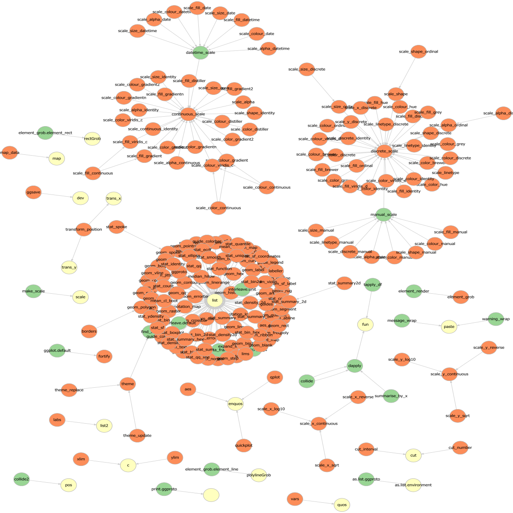

<!-- README.md is generated from README.Rmd. Please edit that file -->

```{r, include = FALSE}
knitr::opts_chunk$set(
  collapse = TRUE,
  comment = "#>"
)
```
# visualize-dots-usages-in-ggplot2

## Background

To introduce [ellipsis package](https://github.com/r-lib/ellipsis) in ggplot2 (see [tidyverse/ggplot2#3196](https://github.com/tidyverse/ggplot2/issues/3196) for the context), we need to review the usages of `...` in ggplot2, which seems impossible by hand. This repository is an attempt to visualize it.

## Define functions

```{r}
`%||%` <- rlang::`%||%`

# if x (a call) has ... in its arguments, return TRUE
has_dots <- function(x) {
  call_args <- rlang::call_args(x)
  any(purrr::map_lgl(call_args, identical, quote(...)))
}

# find the names of functions that take dots
pursue_dots <- function(x) {
  if (!rlang::is_call(x)) {
    return(NULL)
  }
  
  # if x has ..., return the function name
  if (has_dots(x)) {
    # rlang::call_name() returns NULL for anonymous functions and R6 methods
    x_call_name <- rlang::call_name(x)

    # if the call is lapply, actuall function is the second argument    
    if (identical(x_call_name, "lapply")) {
      x_call_name <- rlang::as_string(rlang::call_args(x)[[2]])
    }
    return(x_call_name %||% "")
  }
  
  # if x doesn't has ... directly, try to find ... on each argument recursively
  res <- lapply(x, pursue_dots)
  
  # remove NULL
  res <- purrr::compact(res)
  
  purrr::flatten_chr(res)
}
```

### Test

```{r}
pursue_dots(body(function(...) foo(...)))
pursue_dots(body(function(...) bar(foo(...))))
pursue_dots(body(function(...) stop("not implemented")))
```

## Get data

package version:

```{r}
packageDescription("ggplot2")[c("Version", "GithubSHA1")]
```

```{r}
library(ggplot2)

# get all objects in ggplot2's namespace
ggplot2_ns <- rlang::ns_env("ggplot2")
obj_names <- ls(ggplot2_ns)
obj_names <- purrr::set_names(obj_names)
objs <- lapply(obj_names, get, envir = ggplot2_ns)

# keep functions that takes ...
funs <- purrr::keep(objs, ~ rlang::is_function(.) && any(names(formals(.)) == "..."))

# investigate the bodies of the functions
fun_bodies <- lapply(funs, body)
res <- lapply(fun_bodies, pursue_dots)

# bind them together
res_df <- purrr::map_dfr(res, ~ data.frame(to = ., stringsAsFactors = FALSE), .id = "from")
```

## Result

### Table

```{r}
knitr::kable(dplyr::filter(res_df, to != "list"))
```

### Hubs

The names of functions that actually consume `...`:

```{r}
to <- unique(res_df$to)
to <- purrr::discard(to, ~ . %in% res_df$from)
to
```

Among these, the ones in ggplot2:

```{r}
purrr::keep(to, ~ . %in% obj_names)
```

### Visualize

```{r}
library(DiagrammeR)

nodes <- tibble::tibble(
  fun = unique(c(res_df$from, res_df$to)),
  type = dplyr::case_when(
    fun %in% ls(rlang::pkg_env("ggplot2")) &
      fun %in% ls(rlang::ns_env("ggplot2"))~ "exported",
    fun %in% ls(rlang::ns_env("ggplot2")) ~ "internal",
    TRUE ~ "external"
  )
)


graph <- create_graph() %>% 
  add_nodes_from_table(nodes,
                       label_col = fun, type_col = type) %>%
  colorize_node_attrs(node_attr_from = type,
                      node_attr_to = fillcolor) %>% 
  set_node_attrs(fontcolor, "black") %>%
  add_edges_from_table(res_df, from_col = from, to_col = to, from_to_map = label)

export_graph(graph, file_name = "result.svg", width = 1200, height = 1200)
```

Here's the result:

[](result.svg)